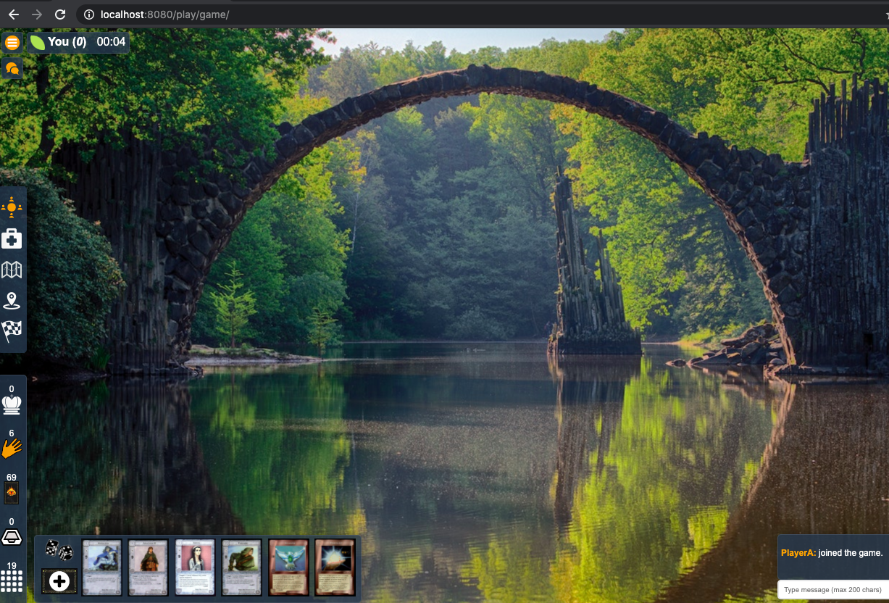
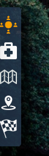
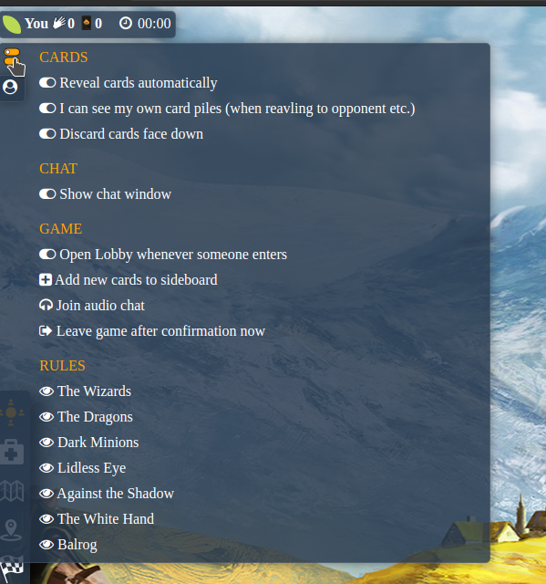
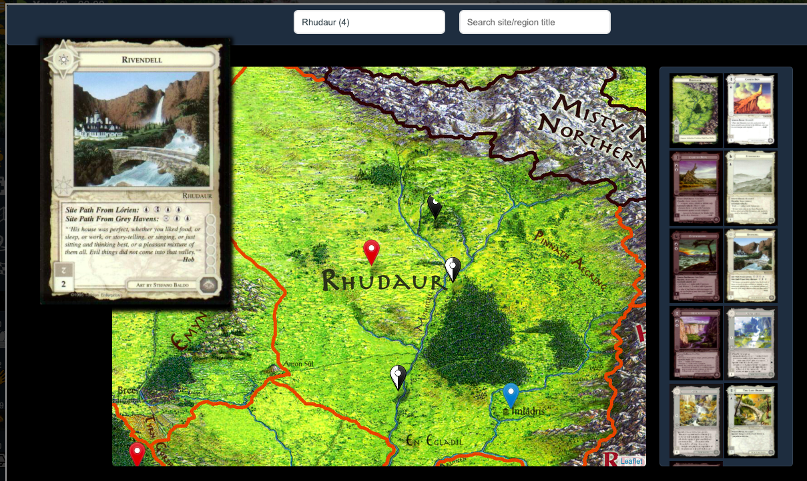
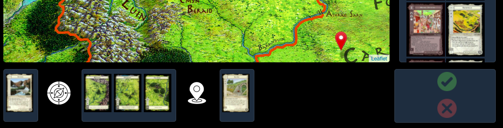
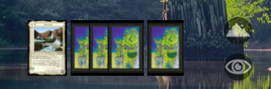

# Collectible Card Game 

This project allows you to play MECCG or similar.

*Middle-earth CCG and LotR are trademarks of Middle-earth Enterprises and/or Iron Crown Enterprises. This is not affiliated with Middle-earth Enterprises or Iron Crown Enterprises.*

## Introduction

This project aims to provide an easy way to setup and maintain a card game server to allow you and your friends to play your favourite card game online.

Although the gameplay is guided by Middle-earth Collectible Card Game, you can easily adapt it to your own game.

Most importantly, you will need to provide the card data and its images. A description of the JSON format will be given below.

*A deckbuilder is yet to be implemented.*

Here are some essential features of this project:

* Intuitive gameplay via drag and drop.
* No (expert) commands necessary.
* No user identity management needed.
* A database server is not needed at all.
* No persistence needed, all works *in-memory*

## Watch the Demo

[](https://www.youtube.com/XFPFwfsEJSg)

## Preparations

Card data and images are not part of this project, so you will have to use a third-party domain to obtain them.

You have to provide certain configuration data using the file ``./data/config.json``. Changes will be ignored via ``.gitignore``. The sample file ``./data/config-example.json`` shows a mock configuration.

### Providing Card Data

The card data file is centra, because all further data is generated from it (which images and sites to use, etc.). 

There are two ways to provide for this json object:

* deploy the card data json file to ``./card-data/cards-raw.json``. This file will be ignored via ``.gitignore``.
* setup a dedicated serverCDN server. This project will then query the endpoint ``/data/cards`` and expects the json object.

### Providing Card Images

This project will query its own endpoint ``/cards/:set/:image`` and you can simply configure a permanent redirect to easiy and conveniently provide the graphic.

A sample request would be as follows:

``/cards/THESET/imagefile.jpg``

The redirect then uses your CDN `https://your-domain.com` and your `image-path` (e.g. `/img/cards`) create a redirect

``https://your-domain.com/img/cards/THESET/imagefile.jpg``

*HTTPS* is required. Otherwise the request will be blocked due to content-transport-policy limitations.


## Running Locally

Make sure you have [Node.js](http://nodejs.org/) installed.

Open your terminal and access this project folder. THen run the following commands:

```
$ npm install
$ npm start
```

Your app should now be running on [localhost:8080](http://localhost:8080/).

### Security

This project does not require any databases or other storage containers. Everything is held in memory only.

All card images are requested from a content delivery server (CDS) to keep images and this application separate.

To avoid cross-site-scripting attacks from the game participant's, the following *Content-Security-Policy* and *X-Content-Security-Policy* are applied in a game:

* default-src 'self'
* script-src 'self'
* img-src 'self' (and the CDS)

*Content-Security-Policy violation attempts can be reported if you provide such an endpoint and additional configuration setting.*

All usernames will be evaluated and the following rules applied:

* Leading and ending whitespaces will be removed.
* The username will be reduced to 30 characters if necessary.
* It will be stripped from any quotes characters.

A username will be rejected if it contains HTML breaking characters `<` or `>` and the login attempt will fail.

## Gameplay

It is assumed that the app runs locally at ``localhost:8080``

### Setting up a new game

There are 2 ways to start a new game:

* Guided via ``localhost:8080/``
* Direct via ``localhost:8080/play/yourgamename``

Each game will be identified by its name in the URL (see *yourgamename* above). The guided method will automatically create such a URL.

You will be asked for a username and a deck to use. These are required.

If you are the first player to join a table, you are considered the table's *host*.


### Joining a game

You can join a game simply by accessing the direct URL or via the list provided on the site's home page (e.g. ``localhost:8080/``)

Once you chose a username and a deck, you will be redirected to a lobby. There, you will have to wait until the table's *host* grants you access to the table. All you have to do is wait there.

### Entering the game table

You will be asked if you want to start the audio chat. This is not supported at the moment but would simply open another browser tab and load the meetings url.

#### A first look

Your table will look similar to this:



The upper left corner shows the players at this table. The active player is highlighted in bold. Next to each player is the card number in hand once the first organisation phase starts.



The icons at the center allow for an easy navigation through phases and indicate in which you are at the moment. _Hovering over each icon will activate a tooltip._


At the lower right are your card piles and are as follows (from top to bottom)

* `Marshaling points` (right click to change score)
* `Toggle hand cards list` (active by default)
* `Play deck` 
* `Discard pile`
* `Sideboard`

You can right-click on the play deck to shuffle it.

#### Game Options

You can access certain options via the options icon.



#### Revealing cards to your opponent

You can reveal cards to your opponent by opening the respective pile and selecting the action at the top of the box.


#### Playing the game

The entire gameplay relys on drag and drop. Available target zones will be highlighted once you are dragging cards.


The company above can be split any time by dragging and dropping the respective cards.

#### Locations and Movement

To select a starting site, simply click on the mountain icon above the company. This will open up a movement frame in which you simply select a starting site.



If there is a starting site, opening the movement window again will allow you to organize the company movement.




The movement window allows you to select target sites. 

When clicking on a region (red marker), you will obtain a list of available sites.

To set/change target sites, simply click on the site card and it will be updated below the map.

Regions can be added to the movement by simply clicking on the respective region card (instead of the site card).

To remove regions from the movement list, simply click on the region card in your current movement.

#### Movement Phase

If you accept the movement, the window will close automatically and the cards will be added to the company. 



To reveal the movement, click on the `eye` below the mountain icon.

#### Site Phase

You can tap a site by right clicking on it. The cards will never be removed from the game  but a tapped state is stored until you either untap it or if your play deck is empty.

#### Empty play deck

If you are out of cards, simply draw a new card. All cards from you discard pile will be added to your play deck and are reshuffled automatically.

#### Organisation Phase / Scoring cards

To store cards, move them to your marshaling points pile. A popup will ask you to specify how (and if) this card should be stored.


You can open the score sheet and manually update each category by right-clicking on the marshalling points pile.

#### Finishing the Game

You can finish the game via the game preferences menu (see above). This will automatically bring up a score sheet with the oval results.

The game will end automatically.

## Adaptation Mechanisms

You have the following default adaptation possibilities:

* Providing your own map
* Providing your own cards

### Providing your own map

To provide your own map, "simply" create all the necessary tiles and deploy them to 

`/media/maps/regions/`

A map file usually has a resolution of 5.376x5.376px or 13.312x13.312px

The following script uses imagemagic to create tiles from a map saved as map.jpg.

```
#!/bin/bash

maxTiles=1

for i in `seq 1 8`
do
    width=$maxTiles
    a=$((256*$width))


    echo "${i}.\tmkdir ./${i}"
    mkdir "./${i}"

    echo "${i}.\tconvert ./map.jpg -resize ${a}x${a} ./${i}/map.jpg into tiles $maxTiles"
    convert ./map.jpg -resize ${a}x${a} ./${i}/map.jpg

    echo "${i}.\tcreate tiles"
    convert ./${i}/map.jpg -crop 256x256 -set filename:tile "%[fx:page.x/256]_%[fx:page.y/256]" +repage +adjoin "./${i}/tile_%[filename:tile].jpg"

    echo "--------"

    maxTiles=$(($maxTiles*2))
done
```

### Providing your own cards

Now, this is not trivial at all, because you will have to put quite a lot of effort into your data.

However, the data structure itself is quite simple, because a simple JSON array of card data properties is all that is required:

```
[{ ... }, { ... }, ...]
```


You can either store this file locally at

`./data/cards-raw.json`

or make it available via your CDN.

The images can either be obtained via a remote server or from your local file system. The configuration file needs to be updated accordingly (see above).

The basic card data object is similar to this

```
{
    "alignment": "Hero|Minion|Neutral",
    "type": "Resource|Hazard|Character|Site|Region",
    "title": "Precious Gold Ring",
    "normalizedtitle": "precious gold ring",
    "code": "Precious Gold Ring (TW) [H]",
    "ImageName": "metw_preciousgoldring.jpg",
    "set_code": "METW",
    "Region": "title of the respective region (for sites only)",
}
```

Each card is identified by its unique `code` and all quotes will be stripped when loading to avoid invalid html tags. 

Importantly, the general code should look similar to this:

`NAME [ALIGNMENT] (SET)`

e.g.

`Precious Gold Ring [H] (TW)`

*Importantly,* a region does not have an alignment in its code and follows the notation

`NAME (SET)`

The `alignment` value allows to differentiate hazard cards ("neutral") from non-hazards.

The `type` has implications on a card's playability:

* Only *Characters* can create a company.
* A *Resource* or *Hazard* can be attached to a chatacter or placed in the staging/event area.
* A *Region* or *Site* will only be available in the map to choose from.

The `set_code` is required and only used for image path purposes (see above). You may limit your cards to exactly one set also.

## Architecture

The HTTP server handles everything but the in-game communication.

The in-game communication is handled via `socket.io` websockets and a reconnection attempt is triggerd automatically should a connection be lost (may happen depending on your internet connection stability).

A websocket requires "knowledge" of the game room's individual access key, your temporary user id and a one-time access token.

Once you successfully connect via the websocket, your one-time access token is invalidated automatically to avoid deny unwanted  connections from other machines.

All these information are served with the game's HTML file in a dedicated `script` block.

Strong content-security-policy (CSP) restrictions are imposed on the game page to really limit connectivity to the sources absolutely essential to play the game - so in theory, a cross-site scripting (XSS) attacks should not be possible. Code injections would be denied as well. Even potential image src attacks should be impossible, because each card graphic is validated by its code (and other images would be blocked due to the CSP settings.

The deck data is also matched against the available card data and used as a read-only source to create a new and individual deck object. The number of cards in your deck is also limited to 300.

### API / Endpoint description

The various endpoints can be found in the `./api` directory.

### Third Party Libraries

Of cource, this project would not be possible without the work of others, and credit should be given.

The following third-party libraries. Be aware of their respective licenses.

* Node.JS - Socket.io 4.0.0 (MIT License)
* Node.JS - Express 4.17.1 (MIT License)
* Node.JS - Express body-parser 1.19.0 (MIT License)
* Node.JS - Express cookie-parser 1.4.5 (MIT License)
* jQuery 3.5.1 (MIT License)
* jQuery UI v1.12.1 - 2021-03-20 (widget.js, data.js, scroll-parent.js, widgets/draggable.js, widgets/droppable.js, widgets/mouse.js, MIT License)
* leafletjs 1.6.0 (BSD 2-Clause "Simplified" License)

#### HTML / CSS 

* Some CSS is taken from https://html5up.net (MIT License)
* The CSS colours and some design ideas were taken from https://cardnum.net (MIT License)
* Font Awesome Free, see https://fontawesome.com/license/free (Icons: CC BY 4.0, Fonts: SIL OFL 1.1, Code: MIT License)

#### Icons and Backgrounds

* All icon licenses are "free for commercial use" with no link back Icons were taken from https://www.iconfinder.com/
* The background image was taken from https://www.pexels.com/ Unfotunately, I cannot remember the link exactly anymore.

## Disclaimer

Middle-earth CCG and LotR are trademarks of Middle-earth Enterprises and/or Iron Crown Enterprises.

## License

This source code is licensed using the MIT License.

Permission is hereby granted, free of charge, to any person obtaining a copy
of this software and associated documentation files (the "Software"), to deal
in the Software without restriction, including without limitation the rights
to use, copy, modify, merge, publish, distribute, sublicense, and/or sell
copies of the Software, and to permit persons to whom the Software is
furnished to do so, subject to the following conditions:

The above copyright notice and this permission notice shall be included in all
copies or substantial portions of the Software.

THE SOFTWARE IS PROVIDED "AS IS", WITHOUT WARRANTY OF ANY KIND, EXPRESS OR
IMPLIED, INCLUDING BUT NOT LIMITED TO THE WARRANTIES OF MERCHANTABILITY,
FITNESS FOR A PARTICULAR PURPOSE AND NONINFRINGEMENT. IN NO EVENT SHALL THE
AUTHORS OR COPYRIGHT HOLDERS BE LIABLE FOR ANY CLAIM, DAMAGES OR OTHER
LIABILITY, WHETHER IN AN ACTION OF CONTRACT, TORT OR OTHERWISE, ARISING FROM,
OUT OF OR IN CONNECTION WITH THE SOFTWARE OR THE USE OR OTHER DEALINGS IN THE
SOFTWARE.
